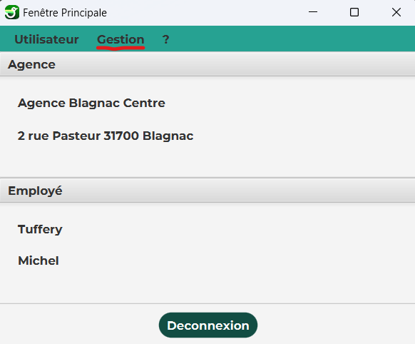

:numbered: true
:toc-title: Sommaire
:toc:

= Doc user V2

[cols="3a,2a,1a", options="header"]
|===
| Etudiant | Groupe | Développement
| Bradley Djedje | 3B4 | Créer un compte, gérer les employés
| Lois Pacqueteau | 3B4 | Créditer/débiter un compte, virement de compte à compte
| Clément Dejean Gourrier | 3B4 | CRUD V1
|===

<<<

    

== Présentation générale

Dans le cadre de la restructuration de ses services bancaires, la banque 'DailyBank' a décidé de développer une application Java-Oracle pour gérer les comptes clients. Cette application remplacera plusieurs outils obsolètes. Voici les fonctionnalités proposées par notre application 

=== Pour le guichetier 

Générer un relevé mensuel d'un compte en PDF
Gérer les prélèvements automatiques
Créditer un compte client
Effectuer un débit exceptionnel

=== Pour le chef d'agence 

Effectuer un débit exceptionnel
Simuler un emprunt
Simuler une assurance d'emprunt +

== Installation/Pré-requis 

Pour l'installation de l'application vous devez avoir
Afin de modifier les employés et les autres chefs d'agence, une connexion à un compte chef d'agence est requise.
Lorsque vous naviguez sur les pages de type "management" des clients ou des employés, il est important de rechercher et de cliquer sur le nom d'une personne pour savoir quelles fonctionnalités elle peut accéder.

== Utilisation

=== Connexion 

Cliquez sur le bouton 'connexion' situé en bas de la fenêtre.

Entrez votre identifiant et votre mot de passe et cliquez sur 'Valider'.

image::image/valider.png[width=150, alt=Exemple d'image, title=Bouton valider]

Vous êtes maintenant connecté à l'application bancaire !

===Les fonctions pour le Guichetier :

=== Créditer/Débiter (Lois PACQUETEAU)

Une fois connecté, cliquez sur 'Gestion' puis sélectionnez 'Clients'.

 

Renseignez les informations du client et cliquez sur 'Rechercher'.

 

Sélectionnez le client recherché et les boutons 'Comptes Client' et 'Modifier Client' deviennent maintenant cliquable. Cliquez sur 'Comptes client'.
Sélectionnez le compte concerné et cliquez sur 'Voir opérations' pour enregistrer un crédit ou un débit.

 

Vous n'avez plus qu'à sélectionner 'Enregistrer débit' ou 'Enregistrer un crédit' et indiquer un montant avant de valider.

 

==== Cas Exceptionnel

Si le montant indiquer est negatif l'operation ne s'effectue pas et le label et textfield devient rouge pour indiquer l'erreur et on remet le focus sur le textfield pour que l'utilisateur puisse modifier le montant.

=== Créer un Client :

Une fois connecté, cliquez sur 'Gestion' puis sélectionnez 'Clients'.
Ensuite, cliquez en bas à droite sur 'Nouveau client'.

 

Une nouvelle fenêtre s'ouvre, ajoutez Nom, Prénom, Adresse, Téléphone et Email en spécifiant si le client est actif ou non.
Enfin, cliquez sur ajouter pour finaliser la création du client.

=== Créer un Compte (Bradley DJEDJE)

Une fois connecté, cliquez sur 'Gestion' puis sélectionnez 'Clients'.
Renseignez les informations du client et cliquez sur 'Rechercher'.
Sélectionnez le client recherché et cliquez sur 'Comptes client'.
Cliquez ensuite sur 'Nouveau compte'.

 

Indiquez le montant du découvert autorisé ainsi que le solde de début (qui doit être supérieur ou égal à 50).

 

=== Clôturer un Compte (Bradley DJEDJE)

Après s’être connecté, cliquer sur 'Gestion' et sélectionner 'Client'.
Renseigner les informations du client et cliquer sur rechercher.
Sélectionner le client et cliquer sur Comptes client.
Sélectionner ensuite un compte.
Cliquer sur ‘Supprimer compte’.

 
Puis valider la clôturassions du compte.

=== Virement Compte à Compte (Lois PACQUETEAU)

Après s’être connecté, cliquer sur 'Gestion'
Sélectionner un client, son compte
Cliquer sur 'Virement' et choisir le montant puis l’identifiant du compte visé

 
 
puis valilder le virement +

==== Cas Exceptionnel

Si le montant indiquer est negatif l'operation ne s'effectue pas et le label et textfield devient rouge pour indiquer l'erreur et on remet le focus sur le textfield pour que l'utilisateur puisse modifier le montant.
Si le compte destinataire n'existe pas ou n'appartient pas client, le label et textfield devient rouge pour indiquer l'erreur et on remet le focus sur le textfield pour que l'utilisateur puisse modifier le destinataire.

=== Ajouter un nouveau prelevement automatique(Lois PACQUETEAU)  +

Dans le gestionnaire des comptes  d'un client , cliquer sur 'Prelevement' 

et sélectionner ensuite 'Creer Prelevement'. +

Renseigner les informations du Prelevement (jour de prelevement, Beneficiaire et montant ) et cliquer sur 'Ajouter'. +

==== Cas Exceptionnel

Si le montant indiquer est negatif le prelevement ne s'effectue pas et une fenetre d'erreur s'affiche pour indiquer l'erreur 

Si le jour de prelevement est superieur a 31 ou inferieur a 0 le prelevement ne s'effectue pas et une fenetre d'erreur s'affiche pour indiquer l'erreur

=== Suprimmer un prelevement automatique (Lois PACQUETEAU) +

Dans le gestionnaire des prelevements du compte  d'un client , cliquer sur le prelevement a supprimer et cliquer sur 'Supprimer Prelevement'. +

Puis valider la supression du prelevement. +

=== Modifier un prelevement automatique (Lois PACQUETEAU) +

Dans le gestionnaire des prelevements du compte  d'un client , cliquer sur le prelevement a modifier et cliquer sur 'Modifier Prelevement'. +

Renseigner les informations du Prelevement (jour de prelevement, Beneficiaire et montant ) et cliquer sur 'Ajouter'. +

les modifications ont les memes exceptions que lors de la creation du prelevement et sont gerer de la meme facon +

=== Use Case Diagram

 

