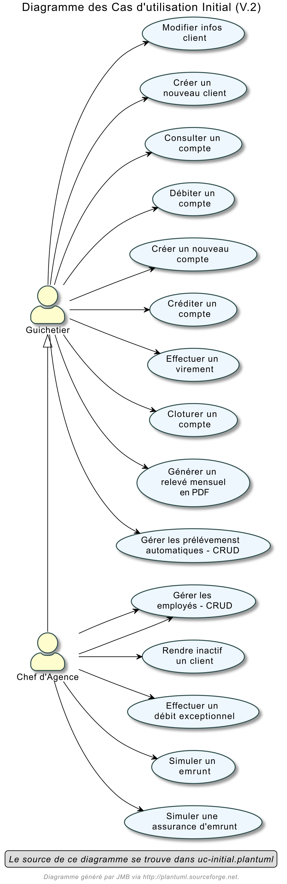
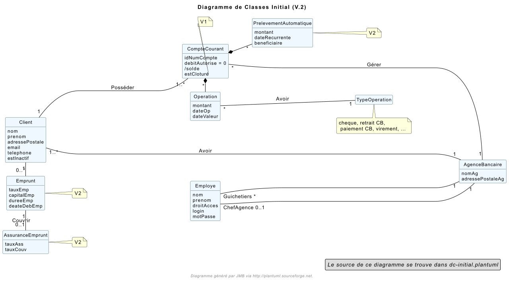
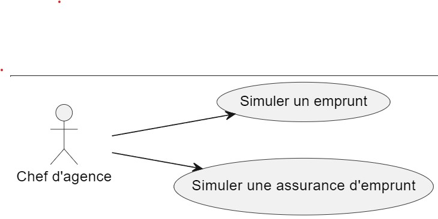
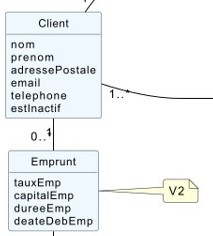

= *Documentation technique V2*
:toc:
:doctype: book
:toc-title: Sommaire
:sectnums:
:Equipe:

= *Page de garde*
[cols="2*"]
|===
| Version | 2

| Date | 24/05/2023

| Équipe | 2B4: +
Loïs Pacqueteau +
Bradley Djedje +
Clement Dejean Gourrié

| Projet | sae2023-bank
|===

== *Présentation de l’Application*

L’application permet de gérer des comptes bancaires de dépôt pour des clients. L’application possède actuellement quelques fonctionnalités tels que modifier les informations clients, créer un nouveau client, consulter un compte, créer un compte, créditer/débiter un compte, effectuer un virement, clôturer un compte, gérer les employés, rendre inactif un client à l’aide des boutons interactifs et des champs à remplir, similer un emprunt, ect...

=== *Use Case*
// image::C:\tmp\sae2022-bank-3b4\Documentation\image\doc tech v2\uc-initialv2.svg[svg,opts=inline]

Le guichetier et le chef d'agence bancaire sont des rôles clés dans le domaine bancaire. Voici une explication de leurs responsabilités respectives :

- Guichetier :
Le guichetier est un employé de la banque qui travaille directement avec les clients au guichet. Ses responsabilités incluent :
* Accueillir les clients et les orienter vers les services appropriés.
* Effectuer des opérations de base telles que les dépôts, les retraits, les virements, l'encaissement de chèques, etc.
* Fournir des informations sur les produits et services bancaires.
* Répondre aux questions des clients et résoudre les problèmes courants.
* Assurer le respect des procédures de sécurité et de conformité lors des transactions.

Le guichetier est généralement la première personne à interagir avec les clients et joue un rôle important dans l'image de la banque et la satisfaction des clients. Il doit être courtois, compétent et avoir de bonnes compétences en service client.

- Chef d'agence bancaire :
Le chef d'agence bancaire est responsable de la gestion globale d'une agence bancaire spécifique. Ses responsabilités comprennent :

* Superviser les opérations quotidiennes de l'agence et garantir leur bon fonctionnement.
* Gérer et superviser l'équipe de l'agence, y compris le recrutement, la formation et l'évaluation des employés.
* Développer et mettre en œuvre des stratégies pour atteindre les objectifs de l'agence en termes de croissance des revenus, de satisfaction des clients et de conformité.
* Assurer le respect des politiques, procédures et réglementations internes et externes.
* Gérer les relations avec les clients importants et résoudre les problèmes complexes.
* Analyser les performances de l'agence, établir des rapports et prendre des mesures correctives si nécessaire.

Le chef d'agence bancaire joue un rôle clé dans la supervision et la coordination de toutes les activités de l'agence pour assurer son bon fonctionnement, la réalisation des objectifs et la satisfaction des clients.

En résumé, le guichetier travaille directement avec les clients au guichet pour effectuer des opérations courantes, tandis que le chef d'agence bancaire est responsable de la gestion globale d'une agence bancaire, y compris la supervision des employés, la réalisation des objectifs et la gestion des opérations.

=== *Diagramme de classe des données global*
Nous avons une base de donnée aui possede un totale de 8 tables.
Nous avons principalement manipulé 5 tables :

Voici les différentes tables de la base de données ainsi qu'une explication des éléments particuliers qui servent et concernent le code développé.

* Employe : Cette table représente les employés de l'agence. Elle contient des informations telles que l'identifiant de l'employé (idEmploye), le nom (nom), le prénom (prenom), les droits d'accès (droitsAccess), le login et le mot de passe (login, motPasse), ainsi que l'identifiant de l'agence à laquelle l'employé est rattaché (idAg). La contrainte "fk_Employe_AgenceBancaire" définit une relation de clé étrangère entre l'employé et l'agence bancaire à laquelle il est rattaché.

* Client : Cette table représente les clients de la banque. Elle contient des informations telles que l'identifiant du client (idNumCli), le nom (nom), le prénom (prenom), l'adresse postale (adressePostale), l'adresse e-mail (email), le numéro de téléphone (telephone), le statut d'inactivité (estInactif) et l'identifiant de l'agence à laquelle le client est rattaché (idAg). La contrainte "fk_Client_AgenceBancaire" définit une relation de clé étrangère entre le client et l'agence bancaire à laquelle il est rattaché. La contrainte "ck_Client_estInactif" assure que la valeur du champ "estInactif" est soit 'O' (inactif) ou 'N' (actif).

* CompteCourant : Cette table représente les comptes courants des clients. Elle contient des informations telles que l'identifiant du compte (idNumCompte), le montant du découvert autorisé (debitAutorise), le solde du compte (solde) et l'identifiant du client auquel le compte est associé (idNumCli). La contrainte "fk_CpteCourant_Client" définit une relation de clé étrangère entre le compte courant et le client auquel il est associé.

* Operation : Cette table représente les opérations effectuées sur les comptes. Elle contient des informations telles que l'identifiant de l'opération (idOperation), le montant de l'opération (montant), la date de l'opération (dateOp), la date de valeur de l'opération (dateValeur), l'identifiant from output d'opération (idTypeOp) qui indique le type d'opération effectuée, l'identifiant du compte sur lequel l'opération a été effectuée (idNumCompte), ainsi que l'identifiant de l'employé ayant effectué l'opération (idEmploye).

* CompteEpargne : Cette table représente les comptes d'épargne des clients. Elle contient des informations similaires à la table CompteCourant, telles que l'identifiant du compte (idNumCompte), le solde du compte (solde) et l'identifiant du client auquel le compte est associé (idNumCli).

//image diagramme de classe
// image::C:\tmp\sae2022-bank-3b4\Documentation\image\doc tech v2\dc-initialv2.svg[svg,opts=inline]

Les flèches entre les différentes tables représentent les relations entre elles. Par exemple, la relation entre AgenceBancaire et Employe indique que chaque agence peut avoir plusieurs employés, tandis que la relation entre Client et AgenceBancaire indique que chaque client est rattaché à une agence spécifique.

En résumé, ce diagramme de classe des données représente la structure de la base de données du système bancaire, en détaillant les tables et les relations entre elles. Il offre une vision globale des entités et de leurs attributs, permettant de gérer les informations relatives aux agences, aux employés, aux clients, aux comptes courants et d'épargne, ainsi qu'aux opérations bancaires.

== *Architecture*

=== *Architecture générale*
Il y a plusieur sous-systèmes comme...

*ressource externe :*

* il faut avoir java 17 au minimum
* avoir un pc

=== *Fonctionnalité*

==== *Simuler un emprunt et l'assurance d'emprunt*
La simulation d'emprunt et la simulation d'asurance permet de faire une simulation
et d'emprunt ou une simulation d'assurance.

*Use Case :*

*Diagramme de classes données nécessaires :*

*Package necessaire*

Package application.view

* EmpruntManagementController.java

Package application.control

* EmpruntManagement.java

*Extrait de code significatifs :*

image::image/doc tech v2/cap ecran code emprunt.jpg[]

La simulation d'emprunt et d'assurance d'emprunt est une mécanique simple qui traite simplement les données entrées par l'utilisateur et effectue les calculs nécessaires en fonction du bouton qui a été cliqué.

Bradley DJEDJE V2